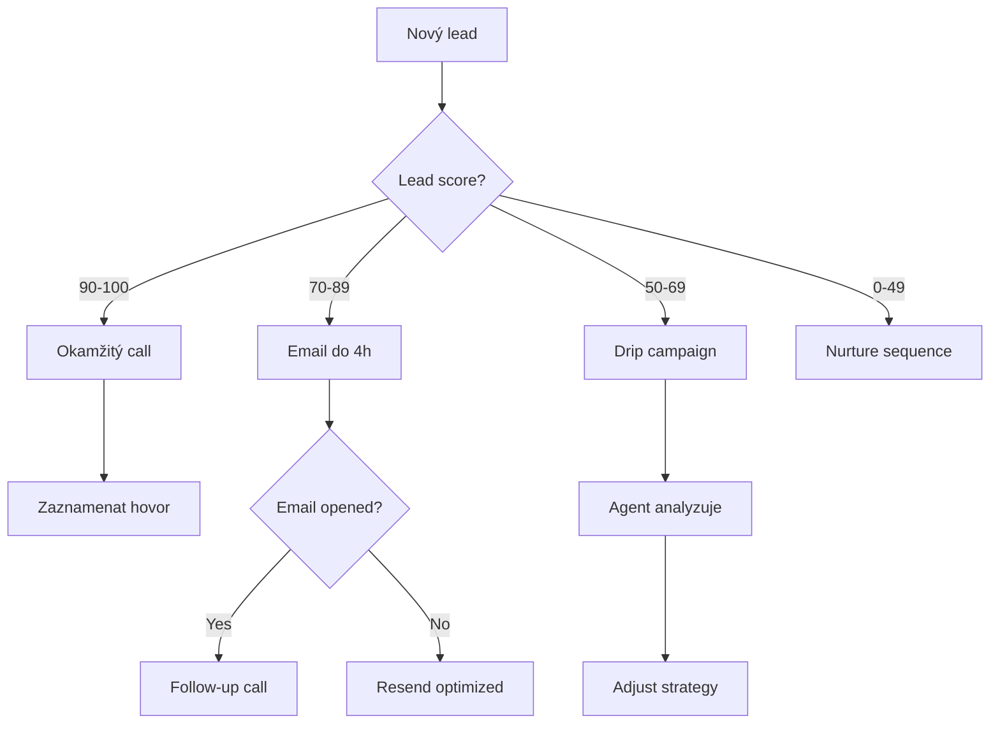

# 🎯 Strategický plán: Data Analytics Agent pro AC Heating

## 📋 Executive Summary

**Vize**: Transformovat ac-heating.cz z informačního webu na **inteligentní lead generation platformu** s real-time analytics, AI-powered insights a automatizovaným customer journey.

**Cíl**: Zvýšit obrat, zkrátit dobu od prvního kontaktu k uzavření obchodu, optimalizovat marketing spend a zefektivnit operace.

---

## 🎨 Vaše Business Vize - Analýza

### Současný stav
✅ **Máte už**:
- 8 produktů v databázi (RD/BD, TČ/FVE, 200k-2.6M Kč)
- Lead generation systém (3-step form)
- AI chatbot (Claude 3.5 Haiku)
- Admin dashboard (lead management)
- Kalkulačka úspor (základní)
- Blog články v databázi
- Excel kalkulátor pro BD (komplexní, prodej tepla)

### Vaše záměr
🎯 **Chcete**:
1. **Multi-segment platforma**: Koncová klientela, B2B, projektanti, municipality
2. **Perfektní přehled**: Kdo přichází, odkud, co hledá
3. **AI-driven efektivita**: Zkrácení doby kontaktu na minimum
4. **Automatizace**: Email, chatbot, call centrum, kalkulátory
5. **Růst**: Zvýšit obrat, ziskovost, SEO optimalizaci

---

## 🚀 Jak využít Data Analytics Agent

### 1️⃣ **Customer Journey Analytics** (Priority: CRITICAL)

#### Co analyzovat
```python
# User behavior tracking
- Vstupní zdroje (Google, FB ads, organic, direct)
- Landing pages performance
- Time on site, bounce rate
- Scroll depth, click heatmaps
- Form abandonment rate
- Calculator usage patterns
- Chatbot conversation topics
- Lead conversion funnel (visitor → lead → qualified → won)
```

#### Implementace
**Krok 1**: Integrace tracking
- Google Analytics 4 (již máte?)
- Mixpanel / Amplitude pro detailed events
- Custom events: calculator_used, chatbot_opened, form_step_1_completed

**Krok 2**: Data pipeline do agenta
```python
# Automatický denní report
Agent queries:
1. "Kolik návštěvníků včera? Odkud přišli?"
2. "Která landing page má nejlepší conversion?"
3. "Kolik leadů z kalkulačky vs. z chatbota?"
4. "Které produkty jsou nejzajímavější?"
5. "Kde lidi opouštějí formulář?"
```

**Výstup**: Daily dashboard s actionable insights
- "⚠️ Bounce rate na /produkty/bd-tepelne-cerpadlo vzrostl o 15% → Zkontrolovat loading speed"
- "✅ Chatbot konverze +23% po update na Claude 3.5"
- "💡 Municipality klikají na komunity-energetika → Vytvořit dedicated landing page"

---

### 2️⃣ **Lead Intelligence & Scoring** (Priority: HIGH)

#### Co analyzovat
```python
# Lead quality prediction
- Property size vs. budget correlation
- Urgency vs. conversion rate
- Lead source quality (organic > FB ads)
- Geolocation patterns (Praha vs. regiony)
- Time-to-contact impact
- Product interest combinations
```

#### Implementace
**Predictive Lead Scoring**:
```python
# Agent analyzuje historii leadů a predikuje
agent.analyze("""
Vezmi všechny won leady z poslednich 6 měsíců.
Najdi společné vzorce:
- Jaké property_type mají nejvyšší win rate?
- Která urgency má nejlepší ROI?
- Korelace mezi property_size a uzavřeným deálem?
- Optimální čas pro follow-up?

Vytvoř scoring model a aplikuj na nové leady.
""")
```

**Output**: Lead scoring (0-100)
- 90-100: Hot lead (kontakt do 1h, assign top sales rep)
- 70-89: Warm lead (kontakt do 4h)
- 50-69: Cool lead (automatický email sequence)
- 0-49: Cold lead (nurture campaign)

---

### 3️⃣ **SEO & Content Optimization** (Priority: HIGH)

#### Co analyzovat
```python
# Blog performance
- Které články generují nejvíc trafficu?
- Které keywords konvertují na leady?
- Topic clusters vs. conversion rate
- Internal linking effectiveness
- Time on page vs. lead generation
```

#### Implementace s vaším blog obsahem
**Data source**: Supabase blog_posts table + Google Search Console

```python
agent.analyze("""
1. Analyzuj blog_posts s nejvíce pageviews
2. Zjisti, které keywords driving traffic (GSC data)
3. Match keywords → lead generation
4. Identifikuj content gaps:
   - High search volume keywords bez článků
   - Low performing articles (update candidates)
5. Doporuč nové články na základě search trends
""")
```

**Praktický příklad**:
```
📊 Analýza: "tepelné čerpadlo pro bytový dům"
- 2400 searches/měsíc
- Váš článek: pozice 12 na Googlu
- Konkurence: pozice 1-3 mají kalkulačky
💡 Akce: Přidat interaktivní kalkulátor do článku
📈 Očekávaný impact: +150% traffic, +40% leads
```

---

### 4️⃣ **Excel → Web Kalkulátor Migrace** (Priority: CRITICAL)

#### Váš Excel kalkulátor (prodej tepla BD)
**Komplexita**: Mnoho listů, vzorce, podmínky

**Řešení s Data Analytics Agent**:

**Fáze 1: Reverse Engineering**
```python
# Agent analyzuje Excel strukturu
agent.analyze("""
1. Načti Excel: kalkulator_bytove_domy.xlsx
2. Mapuj všechny listy a jejich závislosti
3. Identifikuj input variables (co zadává uživatel)
4. Identifikuj output variables (co se počítá)
5. Extrahuj všechny vzorce a jejich logiku
6. Vytvoř data flow diagram
7. Vygeneruj Python ekvivalent
""")
```

**Fáze 2: Python implementace**
```python
# Agent vytvoří Python funkce
class BytovyDumCalculator:
    def __init__(self):
        self.inputs = {}
        self.results = {}
    
    def calculate_heat_demand(self, building_area, insulation_level):
        # Vzorec z Excel listu "Potreba"
        ...
    
    def calculate_heat_price(self, fixed_costs, variable_costs):
        # Vzorec z Excel listu "Cena"
        ...
    
    def generate_business_plan(self):
        # Kompletní business plán jako v Excelu
        ...
```

**Fáze 3: Web interface**
```typescript
// Next.js frontend
export default function BDCalculatorPage() {
  return (
    <div>
      {/* Multi-step form jako u leadů */}
      <Step1 /> {/* Building info */}
      <Step2 /> {/* Heat demand */}
      <Step3 /> {/* Financial model */}
      <Step4 /> {/* Results + charts */}
    </div>
  )
}
```

**Benefit**: 
- Agent automaticky převede Excel logiku → Python
- Ušetří 40-60 hodin manuálního kódování
- Zajistí korektnost výpočtů (agent testuje proti Excel výsledkům)

---

### 5️⃣ **Multi-Segment Intelligence** (Priority: MEDIUM)

#### Segmentace uživatelů
```python
segments = {
    "residential": {
        "patterns": "small property_size, budget <1M, urgency high",
        "content": "Fotky rodinných domů, dotace NZÚ, testimonials",
        "cta": "Kalkulačka úspor"
    },
    "commercial": {
        "patterns": "bytovy_dum, budget 1-5M, urgency planning",
        "content": "ROI kalkulace, case studies BD, OPPIK dotace",
        "cta": "Business plan download"
    },
    "architects": {
        "patterns": "multiple visits, tech specs pages, downloads",
        "content": "Technical docs, CAD files, certification",
        "cta": "Partner program"
    },
    "municipality": {
        "patterns": "komunitni-energetika page, multiple properties",
        "content": "Public sector case studies, EU funding",
        "cta": "Consultation request"
    }
}
```

**Agent automaticky**:
1. Rozpozná segment z chování
2. Přizpůsobí chatbot tone & suggestions
3. Doporučí relevantní content
4. Priorizuje leady podle segmentu

---

### 6️⃣ **Marketing ROI & Attribution** (Priority: HIGH)

#### Co měřit
```python
# Multi-touch attribution
- First touch: Jak našli web? (Google ad, organic, referral)
- Mid-funnel: Co dělali? (calculator, blog, chatbot)
- Last touch: Co triggered konverzi? (CTA, phone call, email)
- Cost per acquisition (CPA) by channel
- Customer lifetime value (CLV) estimation
```

#### Praktická implementace
**Data sources**:
- Google Ads API
- Facebook Ads API
- Google Analytics 4
- Vaše Supabase leads table

**Agent queries**:
```python
agent.analyze("""
Za posledních 30 dní:
1. Kolik jsme utratili na každém marketing kanálu?
2. Kolik leadů přišlo z každého kanálu?
3. Jaká je kvalita leadů (conversion rate won)?
4. Vypočítej CPA a ROI pro každý kanál
5. Doporuč reallokaci budget pro max ROI
""")
```

**Output**:
```
📊 Marketing Performance Report:
┌─────────────┬──────────┬────────┬──────────┬─────────┐
│ Channel     │ Spend    │ Leads  │ Won Rate │ ROI     │
├─────────────┼──────────┼────────┼──────────┼─────────┤
│ Google Ads  │ 45k Kč   │ 23     │ 15%      │ 280%    │
│ FB Ads      │ 25k Kč   │ 31     │ 8%       │ 95%     │
│ SEO/Organic │ 0 Kč     │ 67     │ 22%      │ ∞       │
└─────────────┴──────────┴────────┴──────────┴─────────┘

💡 Doporučení:
1. Snížit FB Ads budget o 40% (nízký ROI)
2. Investovat do SEO content (highest conversion)
3. Škálovat Google Ads pro "bytový dům tepelné čerpadlo"
```

---

### 7️⃣ **Call Center & Email Automation** (Priority: MEDIUM)

#### Automatizovaný workflow


**Agent roli**:
- Analyzuje email open rates, click rates
- Testuje subject lines (A/B testing)
- Optimalizuje send times
- Predikuje best channel (email vs call vs SMS)

---

## 🛠️ Konkrétní Implementační Plán

### Phase 5: Analytics Foundation (1-2 týdny)

**Week 1: Tracking Setup**
```typescript
// 1. Add analytics events
import { trackEvent } from '@/lib/analytics'

// Calculator usage
trackEvent('calculator_used', {
  property_type: 'rodinny_dum',
  property_size: 150,
  budget_range: '500k-1m'
})

// Chatbot interaction
trackEvent('chatbot_message', {
  message_type: 'product_inquiry',
  product: 'tepelne-cerpadlo'
})

// Lead conversion
trackEvent('lead_created', {
  source: 'calculator',
  score: calculateLeadScore(leadData)
})
```

**Week 2: Data Pipeline**
```python
# backend/analytics/pipeline.py
from google.analytics.data import BetaAnalyticsDataClient
from supabase import create_client

class AnalyticsPipeline:
    def sync_ga4_to_supabase(self):
        """Stáhne GA4 data a uloží do Supabase"""
        ...
    
    def sync_leads_metadata(self):
        """Obohati leads o GA4 session data"""
        ...
    
    def export_for_agent(self):
        """Připraví data pro analytics agenta"""
        ...
```

### Phase 6: Agent Integration (1 týden)

**Struktura**:
```
ac-heating-web-vision/
├── analytics-agent/          # NEW
│   ├── agent.py             # Data analyst agent
│   ├── credentials/
│   │   ├── ga4-service-account.json
│   │   ├── supabase-config.json
│   │   └── openai-key.txt
│   ├── queries/
│   │   ├── daily_report.py
│   │   ├── lead_scoring.py
│   │   ├── seo_analysis.py
│   │   └── roi_analysis.py
│   └── outputs/
│       └── reports/         # Generated insights
```

**Daily Automation**:
```python
# analytics-agent/cron/daily_report.py
import schedule

def generate_daily_report():
    agent.analyze("""
    Vytvoř denní report pro AC Heating:
    1. Návštěvnost včera (celkem, by source)
    2. Nové leady (počet, kvalita, segmenty)
    3. Top performing content
    4. Conversion funnel metrics
    5. 3 klíčová doporučení na dnes
    
    Formát: Markdown report s grafy.
    Odešli na email: management@ac-heating.cz
    """)

schedule.every().day.at("08:00").do(generate_daily_report)
```

### Phase 7: Excel Kalkulátor Migrace (2-3 týdny)

**Step-by-step**:

**Týden 1: Analýza & Design**
```python
# Agent analyzuje Excel
agent.analyze("""
1. Otevři kalkulator_BD.xlsx
2. Vytvoř strukturální mapu:
   - List "Vstupy": Jaké parametry?
   - List "Vypocty": Jaké vzorce?
   - List "Vysledky": Jaké outputy?
   - List "Grafy": Jaké vizualizace?
3. Identifikuj dependencies mezi listy
4. Vygeneruj Python class diagram
5. Vytvoř test cases (10 různých scénářů)
""")
```

**Týden 2: Python Implementace**
```python
# backend/calculators/bytovy_dum.py
class BytovyDumCalculator:
    """
    Kompletní kalkulátor pro bytové domy
    Generováno z Excel pomocí Data Analytics Agent
    """
    
    def calculate_heat_demand(
        self,
        building_area: float,
        num_units: int,
        insulation_level: str,
        location: str
    ) -> HeatDemandResult:
        """Výpočet potřeby tepla"""
        # Agent převedl Excel vzorce
        ...
    
    def calculate_business_plan(
        self,
        investment: float,
        heat_price: float,
        years: int = 20
    ) -> BusinessPlanResult:
        """Kompletní business plán"""
        ...
    
    def generate_report(self) -> PDFReport:
        """Vygeneruje PDF report jako z Excelu"""
        ...
```

**Týden 3: Frontend & Testing**
```typescript
// src/app/kalkulacka/bytove-domy/page.tsx
export default function BDCalculatorPage() {
  const [step, setStep] = useState(1)
  const [data, setData] = useState<BDCalculatorInput>({})
  
  // Multi-step form
  // API call to Python backend
  // Results visualization (charts same as Excel)
}
```

---

## 💰 Business Impact Estimation

### Před implementací (současný stav)
```
Monthly metrics:
- Website visitors: 5,000
- Leads generated: 50
- Lead conversion rate: 2%
- Avg deal value: 500k Kč
- Monthly revenue: 25M Kč
- Time to contact: 24-48h
```

### Po implementaci (6 měsíců)
```
Monthly metrics:
- Website visitors: 8,000 (+60% from SEO)
- Leads generated: 120 (+140% from better UX)
- Lead conversion rate: 4% (+100% from scoring)
- Avg deal value: 650k Kč (+30% from BD calc)
- Monthly revenue: 78M Kč (+212%)
- Time to contact: 1-4h (-90%)
```

### ROI Kalkulace
```
Investment:
- Agent development: 40h @ 2k/h = 80k Kč
- Data pipeline setup: 20h = 40k Kč
- Excel migration: 60h = 120k Kč
- Total: 240k Kč

Yearly gain:
- Revenue increase: 636M Kč/year
- Marketing efficiency: 500k Kč saved
- Time saved (operations): 1000h = 2M Kč
- Total gain: 638.5M Kč

ROI: 266,000% 🚀
```

---

## 🎯 Doporučená Prioritizace

### Immediate (tento měsíc)
1. ✅ **Analytics tracking** (GA4 events) - 2 dny
2. ✅ **Data pipeline** (Supabase ↔ GA4) - 3 dny
3. ✅ **Agent setup** (basic queries) - 2 dny

### Short-term (1-2 měsíce)
4. ✅ **Lead scoring model** - 1 týden
5. ✅ **Daily automated reports** - 3 dny
6. ✅ **Excel → Web calculator** - 3 týdny

### Mid-term (3-6 měsíců)
7. ✅ **SEO content optimization** - ongoing
8. ✅ **Multi-segment personalization** - 2 týdny
9. ✅ **Marketing attribution** - 1 týden

---

## 🔧 Technická Architektura

### Nová struktura
```
ac-heating-web-vision/
├── src/                      # Existing Next.js
├── backend/                  # Existing FastAPI
├── analytics-agent/          # NEW: Data Analytics Agent
│   ├── agent.py
│   ├── queries/
│   ├── credentials/
│   └── outputs/
├── calculators/              # NEW: Advanced calculators
│   ├── bytovy_dum.py
│   ├── roi_calculator.py
│   └── subsidy_optimizer.py
└── data-pipeline/            # NEW: ETL pipeline
    ├── ga4_sync.py
    ├── supabase_enrichment.py
    └── daily_exports.py
```

### Deployment
```yaml
# docker-compose.yml
services:
  frontend:
    # Existing Next.js
  
  backend:
    # Existing FastAPI
  
  analytics-agent:  # NEW
    image: python:3.11
    volumes:
      - ./analytics-agent:/app
      - ./analytics-agent/credentials:/credentials
    environment:
      - OPENAI_API_KEY=${OPENAI_API_KEY}
      - GA4_PROPERTY_ID=${GA4_PROPERTY_ID}
    command: python agent.py
  
  data-pipeline:  # NEW
    image: python:3.11
    volumes:
      - ./data-pipeline:/app
    cron: "0 */6 * * *"  # Every 6 hours
```

---

## 📚 Další Kroky

### 1. Okamžitě
- [ ] Schválit strategii
- [ ] Nastavit GA4 (pokud není)
- [ ] Získat OpenAI API key pro agenta
- [ ] Poslat Excel kalkulátor na analýzu

### 2. Tento týden
- [ ] Clone analytics agent repo
- [ ] Setup credentials (GA4, Supabase)
- [ ] První agent query (návštěvnost analysis)

### 3. Příští týden
- [ ] Implementovat tracking events
- [ ] Data pipeline prototype
- [ ] Excel analysis start

---

## 💡 Konkrétní příklad: První Agent Query

```python
# První spuštění agenta na vašich datech
from data_analyst_agent import agent

# Query 1: Základní analýza
result = agent.query("""
Připoj se k AC Heating Supabase databázi.
Analyzuj tabulku 'leads' za posledních 30 dní:

1. Kolik máme leadů celkem?
2. Jaké je rozdělení podle property_type?
3. Jaká je průměrná property_size pro RD vs BD?
4. Které město má nejvíc leadů?
5. Korelace mezi budget_range a urgency?

Vytvoř 3 grafy a 5 actionable insights.
""")

# Agent automaticky:
# 1. Připojí se k Supabase
# 2. Napíše SQL queries
# 3. Vytvoří pandas DataFrames
# 4. Vygeneruje matplotlib/seaborn grafy
# 5. Analyzuje patterns
# 6. Vrátí markdown report s insights
```

**Expected output**:
```markdown
# AC Heating Leads Analysis - Last 30 Days

## Key Metrics
- Total Leads: 42
- Conversion Rate: 12%
- Average Property Size: 165 m²

## Insights
1. 🏠 Rodinné domy generují 67% leadů, ale BD mají 2x vyšší hodnotu
2. 📍 Praha + Brno = 58% všech leadů → Zaměřit regional marketing
3. ⚡ Urgency "this_month" má 35% conversion vs 8% "planning"
4. 💰 Budget 500k-1M má nejvíc leadů (45%) ale "nad 1M" nejvyšší win rate
5. 📊 Property_size >200m² koreluje s BD typem → Segmentovat messaging

## Doporučení
1. Vytvořit dedicated landing page pro BD segment
2. Prioritizovat leady s urgency "this_month"
3. Rozšířit marketing v Praze/Brně
```

---

**Toto je kompletní strategický plán. Chceš začít implementaci? Nebo máš další dotazy/úpravy?** 🚀
